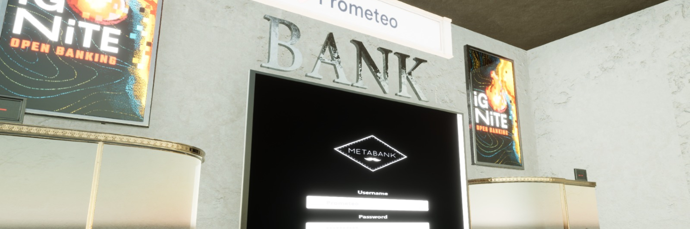

 

# MetaBank - VR Finance Experience

MetaBank is a **VR/Game** POC designed for the **Ignite Open Banking Hackathon** to show the capabilities of using banking services with VR applications, it's a simple implementation of financial rules and algorithms to showcase the reach and value this type of solutions can bring in the future.

**Goal**: VR Enabled environment where a user can check his finances, financial health and insights.  

**Description**: The POC Level has a screen that shows a dashboard with the user monthly movements, the code crunches the data and offers insights based on the categories that the user spends the most and the least.

**TLDR**: A VR / Metaverse Bank Dashboard.

#  DEMO - Project Files (Windows Only): 

Download the files and execute the **MetaBank.exe** file inside

### Version 3.0.0
- [https://mega.nz/file/ihg1jZ6Y#HrTRkFI7KmyTedml-kHVE3w4BrutWRKLekAl-Y6ZeZg](https://mega.nz/file/ihg1jZ6Y#HrTRkFI7KmyTedml-kHVE3w4BrutWRKLekAl-Y6ZeZg)

# Controls

## On Foot

- **ESC** - Close Application
- **WASD** - Movement
- **Mouse** - Look Around

## Screen Interaction- *If you walk closer to the screen you can interact with the dashboard*

- **Mouse** - Interact with Dashboard
- **Keyboard** - You can type in the text fields that are in the dashboard
- **Scroll wheel** - You can scroll LOL!    

# Media
- TBA

# Stack
- Unreal Engine 4
- Javscript
- Node.js
- Prometeo API

